穷光蛋的忧伤
===

 

## 课题研究背景

随着我国国民经济的持续增长和经济形势的多样化，人们收入与支出的形式也出现多元化，所以我们需要一个简便、明了的记账本来管理我们日常支出和收入，以合理管理支出行为。记账本软件不仅可以帮你记账，更多的是可以实时掌握你的支出和收入，掌握资金的变动情况，同时还可以统计出资金的主要流向，从而更合理的分配资金。

 

## 简介

穷光蛋的忧伤是一个简洁的记账软件，基于 Google Material Design 设计风格，使用 Android DrawerLayout 布局和 Fragment 碎片化结构，具有清晰、简便、明了、友好的操作界面；提供了最主要的记账软件功能，简单易用，安全稳定。

 

## 需求：功能清单

- 显示账单列表

- 修改列表的列数

- 添加账单

- 修改、删除账单

- 长按拖拽上下交换

- 右滑删除账单

- 选择账单种类

- 记录账单详情

- 选择消费地点

- 选择日期时间

- 财务统计

- 数据预测

- 登录注册

- 用户信息与修改

- 云同步

- 数据库备份

- 分享APP给好友

- 发送账单文本

- 对话框动画

 

## 完成情况小结

郎秀心：PersonActivity用户信息与修改、LoginActivity登录注册、FinanceFragment财务统计、Sweet-alert-dialog对话框库、图标搜集

胡伶华：RecycleView账单列表、RecordActivity添加账单、修改/删除账单、Linear-time-picker日期时间选择器库、环境测试

王鑫益：GitHub版本控制、RecycleView滑动手势、Fragment碎片化、GridLayout单选网格布局、PHP后端、Sync云同步、Sqlite数据库、好友分享、SettingsActivity设置、Amap高德地图

Git地址：https://github.com/MRXY001/Poorrow/

未完成：数据预测、高德地图

 

## 主体框架

**主题**：基于 Google Material Design 设计风格

**框架**：使用 Android DrawerLayout 布局、Fragment 碎片化结构、PHP云同步机制

**架构**：数据层为纯文本XML格式数据，可靠且便于存储于传输；业务层用于控制数据安全性与稳定性；展示层显示数据并处理用户交互

**数据**： Sqlite <\==> Sdcard <==> Server

####        文件清单：

1、源代码文件清单

- BillsFragment/ 账单文件夹

    - DummyContent.java 账单工厂类

    - BillsFragment.java 账单碎片

    - MyBillRecyclerViewAdapter.java 账单列表适配器

    - BlankDataFragment.java 没有账单的碎片

    - RecycleItemTouchHelper.java 列表手势滑动

- RecordActivity/ 记录账单文件夹

    - KindBean.java 种类JavaBean

    - MyKindAdapter.java 种类列表适配器

    - MapActitity.java 选择地图的活动

    - RecordActivity.java 添加/修改/删除账单的活动

- Utils/ 工具类

    - DateTimeUtil.java 日期时间

    - FileUtil.java 文件读入/写出

    - NetworkUtil.java 网络（取网页源码）

    - SettingsUtil.java 设置（保存/读取设置）

    - StreamUtil.java 流（网页instream转换成文本）

    - StringUtil.java 字符串工具类

    - UserInfo.java 用户信息

    - Global.java 全局变量（云同步域名）

    - MyOpenHelper.java 数据库Helper

    - SqlUtil.java 数据库类

- MainActivity.java 主界面的活动

- ExportFragment.java 导入/导出碎片

- FinanceFragment.java 财务统计碎片

- LoginActivity.java 登录/注册活动

- PersonActivity.java 用户信息活动

- PredictFragment.java 数据预测碎片

- AppCompatPrefrenceActivity.java 设置活动自动生成的类

- SettingsActivity.java 设置活动

- PlusOneButtonFragment.java 谷歌+1按钮碎片

2、布局文件清单

- activity_login.xml 登录界面

- activity_main.xml 主界面大题界面

- actviity_map.xml 地图界面

- activity_person.xml 个人信息界面

- activity_record.xml 添加账单界面

- app_bar_main.xml 应用栏容器

- content_main.xml 主界面内容

- content_person.xml 个人信息界面

- editbox.xml 对话框界面

- fragment_bill.xml 账单item卡片布局

- fragment_bill_list.xml 账单列表

- fragment_blank.xml 空列表显示的账单

- fragment_export.xml 导入导出界面

- fragment_finance.xml 财务统计界面

- fragment_plusone.xml 谷歌+1按钮界面

- fragment_predict.xml 数据预测界面

- item_kind.xml 账单种类item界面

- nav_header_main.xml 主界面抽屉头像部分

3、菜单文件清单

- activity_main_drawer.xml 抽屉菜单

- main.xml 主界面右上角三点菜单

- menu_person.xml 用户界面的设置菜单

4、常量文件清单

- colors.xml 颜色常量

- dimens.xml 位置常量

- strings.xml 字符串常量

 

 

## 使用情况

 

RecycleView 账单列表

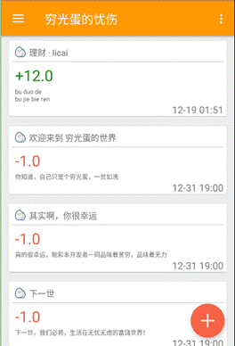

 

RecycleView 手势操作：长按拖拽、右滑删除

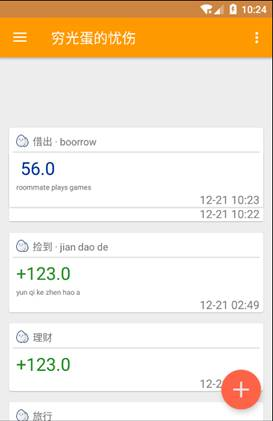

 

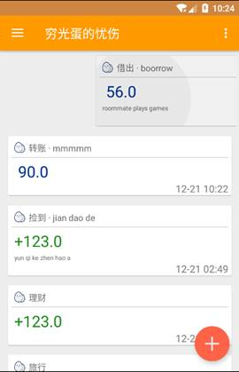

 

Fragment 碎片化布局：Fragment可以使你能够将activity分离成多个可重用的组件，每个都有它自己的生命周期和UI。

Fragment是一个独立的模块,紧紧地与activity绑定在一起。可以运行中动态地移除、加入、交换等。

Fragment提供一个新的方式让你在不同的安卓设备上统一你的UI。

Fragment 解决Activity间的切换不流畅，轻量切换。。

Fragment做局部内容更新更方便，原来为了到达这一点要把多个布局放到一个activity里面，现在可以用多Fragment来代替，只有在需要的时候才加载Fragment，提高性能。

可以从startActivityForResult中接收到返回结果,但是View不能。

 

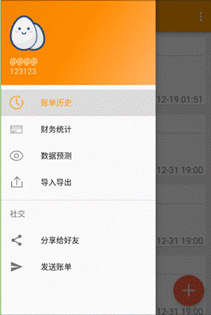

 

Add 添加账单：点击账单列表右下角的加号添加账单记录，能够选择支出、收入或者借贷三种类别，三大类之下各有几种小类以供选择。可以输入金额和添加备注以及修改时间。

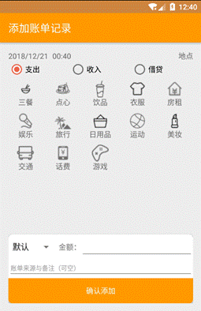

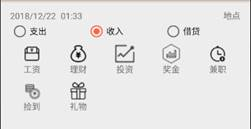

 

Modify 修改账单：单击一条账单信息进入修改账单的界面，可以更改账单记录时间，账单类别、金额和备注等；也可以进行删除操作。

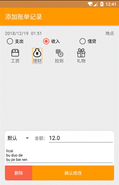

 

GridLayout 可选中的类别布局：点击某个小类，周围出现选中款，再次点击可取消

 

 

Login 登录注册：输入用户名称（只接受邮箱格式），用户密码（不少于6个字符）进行登录注册。

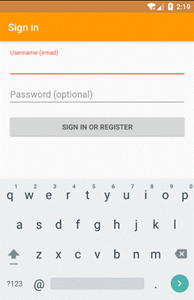

 

PHP 服务端：处理所有上传的数据

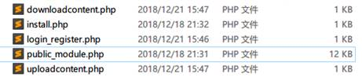

 

UserInfo 用户信息与修改：可修改昵称、密码、签名、手机号，不可修改用户名。下面会显示使用天数，账单条数。修改完用户信息后，点击右上角的刷新图标进行同步刷新。

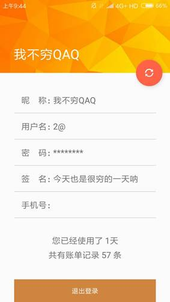

 

Sync 云同步

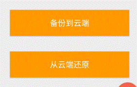

Sqlite 数据库

 

AMap 高德地图（有bug）

 

财务统计：可以统计今日、昨日、七天和当月的收入与支出以及结余状况。

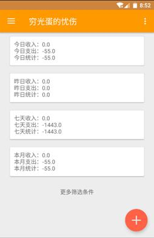

 

数据预测（未完成）

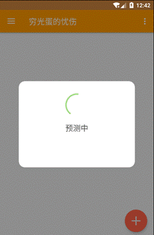

 

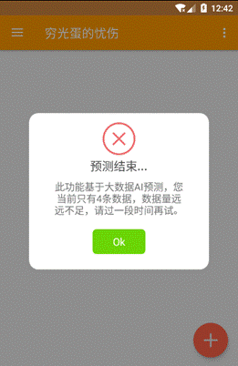

 

UI CardView 界面设计：特殊点就是有rounded corner（圆角）和shadow（阴影）。

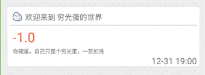

 

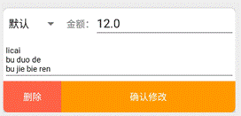

 

ListFragment 多列设计：点击右上角的列数也改变账单的排版。

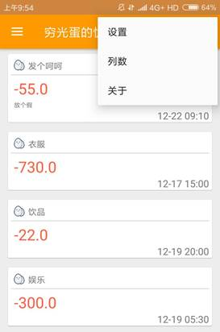

 

      

 

Share 分享

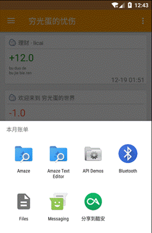

 

Settings 设置

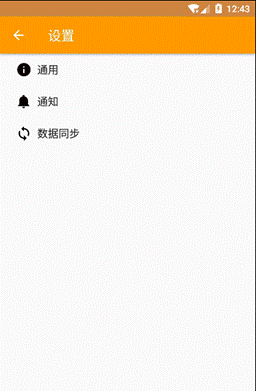

 

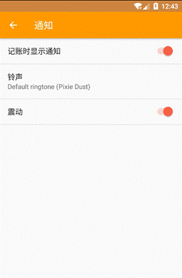

 

日期时间选择：使用了lineartimepicker线性日期时间选择器更改账单记录的日期和时间。

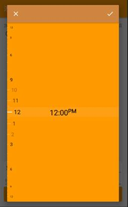

 

sweet-dialog 对话框：非常的圆润嘿嘿嘿

 

 

## 小组工作情况

王鑫益：总体框架结构、UI、UX设计，50%

郎秀心：用户模块，25%

胡伶华：账单模块，25%

 

## 使用技术

**有难度**：

- DrawerLayout 侧滑菜单

- Fragment 碎片化布局

- PHP 后端

- 云同步

- UI布局

**有特色**：

-  数据预测（但未完成）

- 可选中的网格类别布局

- 日期时间选择器

- 带动画的对话框

 

## 小结

经过几个星期的设计与开发，基于安卓的穷光蛋记账本基本开发完成，实现了记账本系统的基本功能，界面友好，在小范围内测试，基本达到了用户的需求。但记账本仍存在一些不足的地方，比如实现高德地图定位、使用已有数据进行分析预测以及如何将该软件与用户的“支付宝”、“微信”等常用支付工具进行连接，还是该记账本要进一步解决的问题。

通过这次设计与开发，收获颇多，从理论到实践，不仅巩固了以前学过的知识，还学到了很多在书本上所没有学到过的知识，提高了实际动手能力和独立思考的能力。在设计的过程中虽然遇到了许多问题，但经过一次次的思考和检查终于找出原因所在。

实验过程中，对团队精神也进行了考察，让我们合作起来更加默契，提高了每个组员的团队协作能力，为大家日后的自我提升打下了良好的基础。

 

 

 